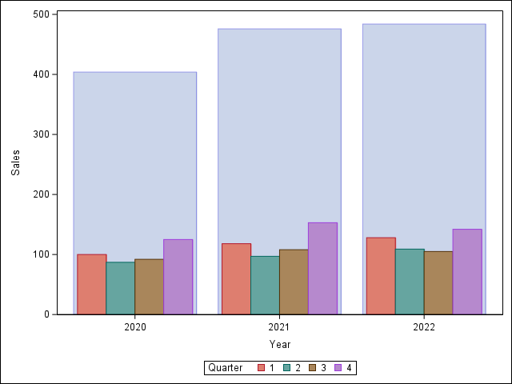

[Graphics Samples Output Gallery](https://support.sas.com/en/knowledge-base/graph-samples-gallery.html)  

#1. Nested bar charts  
Source: https://blogs.sas.com/content/iml/2025/03/31/nested-bar-charts.html  


```sas
data Bars;
    do Year = 2020 to 2022;
        do Quarter = 1 to 4;
            input Sales @;
            output;
        end;
    end;
datalines;
100  87  92 125
118  97 108 153
128 109 105 142
;

proc sgplot data=Bars;
    vbarbasic Year / response=Sales transparency=0.6;
    vbarbasic Year / response=Sales group=Quarter groupdisplay=cluster clusterwidth=0.8;
run;
```

#2. bar chart with confidence limits  
Source: https://support.sas.com/kb/69/822.html  
  

```sas
proc sgplot data=carsMean;
    /* Generate a horizontal bar chart for average mileage in city driving 
       using calculated limits */
    hbarparm category=type response=mean / 
        fillattrs=(color=cxa6bddb)
        limitlower=lclm limitupper=uclm
        limitattrs=(color=black);
        
    yaxis display=(nolabel) grid;
    xaxis display=(nolabel);
run;
```